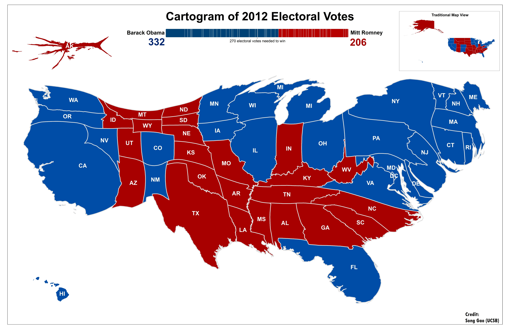
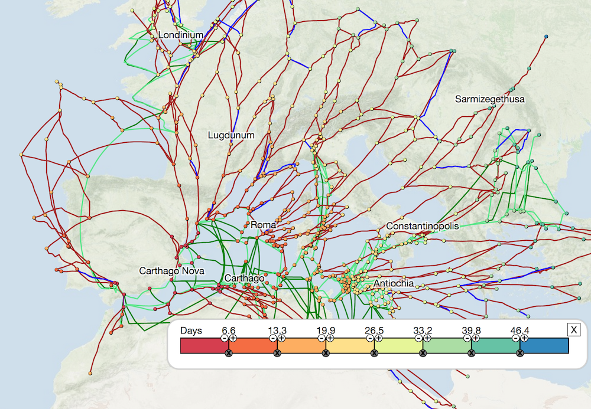
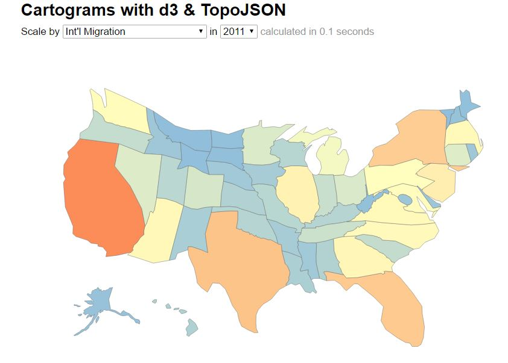
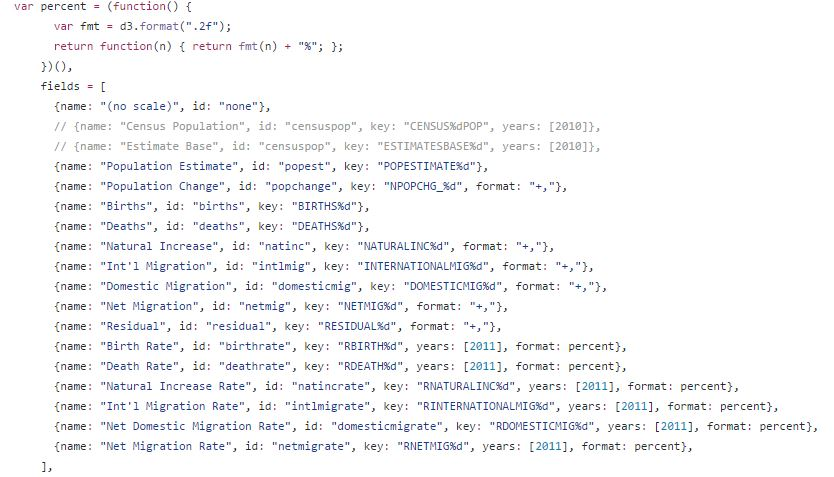

# Cartogram

> Spring 2017 | Geography 472/572 | Geovisualization: Geovisual Analytics
>
> By: Nick Mathews and Riley Johnson

## 1. What is a Cartogram?

A cartogram is a thematic map that displays a variable as a size or distance. Cartograms can represent socio-economic, population, or other types of variables by distoring geometric space of the map. This distortion is intended to represent the variable data proportioinally.

There are several types of cartograms that handle geometric distortion and  in a variety of ways.

## 2. Contiguous Cartograms

Contiguous cartograms preserve shape contact, or neighborhood, by simultaneiously skewing the shapes' geometries while altering their size.

This example area cartogram shows the 2012 Presidential Election results. Each state is scaled relative to the number of electoral votes they have. 

*Source: http://stko.geog.ucsb.edu/node/11*

*Source: https://digitalhumanities.stanford.edu/projects/orbis*

This is a distance cartogram showing dynamic distance cartograms from any point, using any vehicle, mode, or time of year settings. For instance, the above cartogram from Carthago Nova. Cartograms can be run by clicking on sites or via a Cartogram tab that provides the same kind of interface as routes.

## 3. Cartograms using d3 & Topojson

http://prag.ma/code/d3-cartogram/#intlmig/2011

The code above lists the data used to generate the cartogram. Birth rates, death rates, migration, etc. are all found within the data csv file.

This d3 javascrpit library uses the Rubber Sheet Distortion method to create an area contiguous cartogram that preserves shape with distortion as well as preserving topology, although that is not guaranteed. 

The d3 library works by using a topojson to decocode topojson-encoded topologies. Takes topojson files converts them to another topojson that then is projected into the equal area map projection wit  the new distortion from the cartogram libraries algorithm.

*Source: https://github.com/shawnbot/topogram*

This is the github repository where d3 cartogram can be downloaded from.
